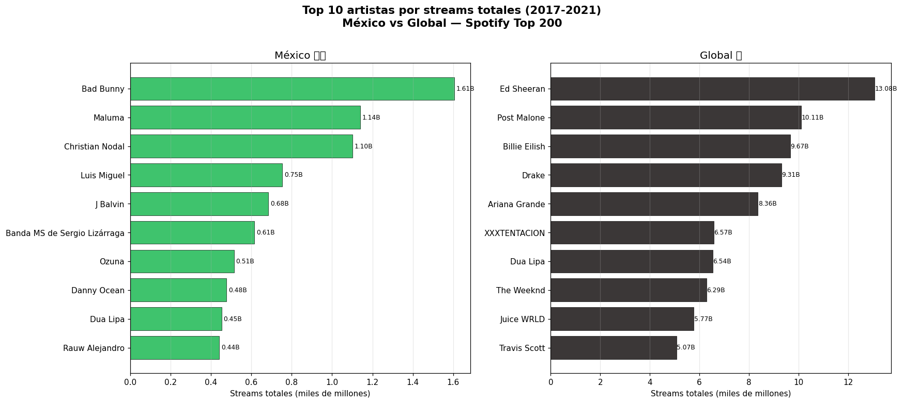
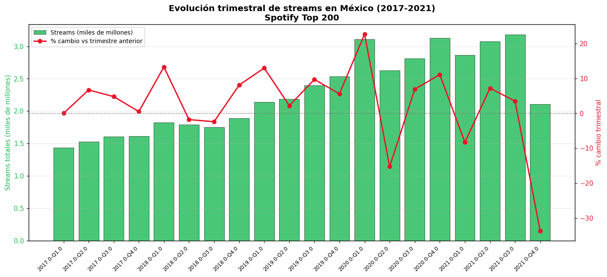
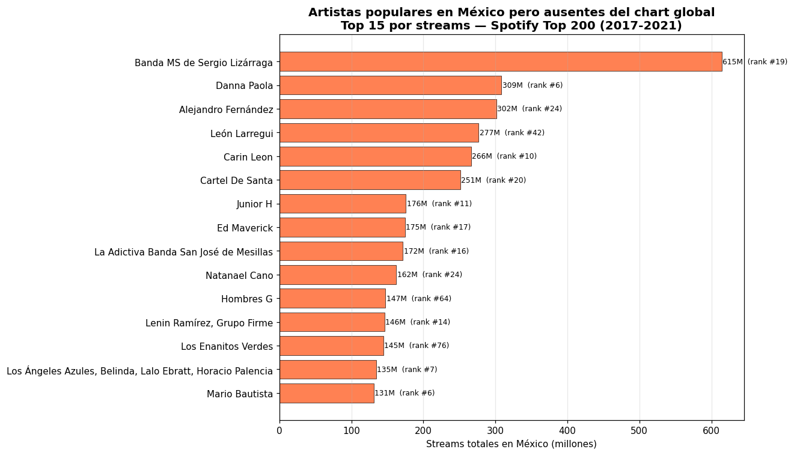
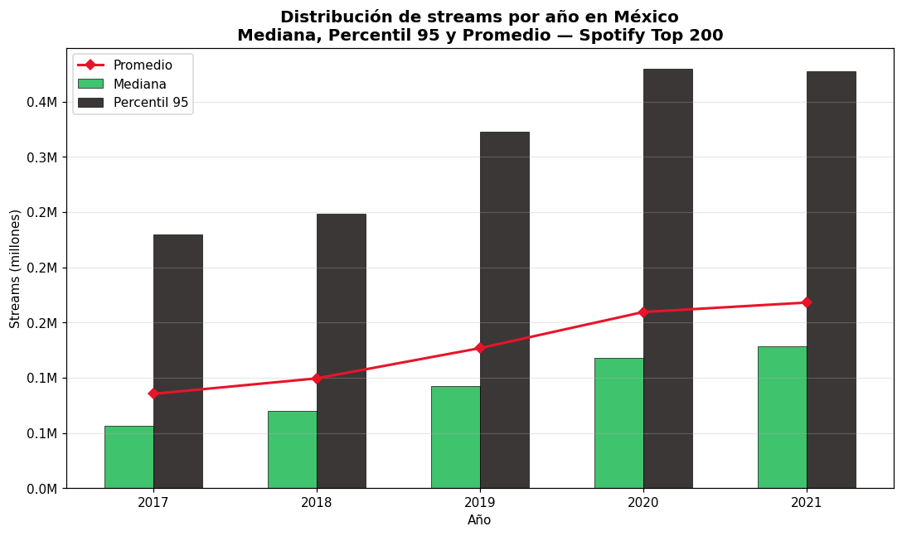

# Spotify Charts: México vs el mundo (2017-2021)

## Pregunta analítica

La idea de este proyecto surgió de una observación bastante simple: cuando escucho Spotify en México suena muy diferente a lo que aparece en los rankings globales. Eso me llevó a preguntarme si esa diferencia se puede medir y cuantificar con datos reales.

La pregunta central es: **¿qué tan diferente es el gusto musical de México comparado con el chart global de Spotify entre 2017 y 2021?** Y de ahí se desprenden tres subpreguntas más concretas que son las que guían todo el análisis:

1. ¿Qué artistas acumularon más streams en México comparado con el chart global?
2. ¿Hay artistas que dominan México pero que globalmente son completamente invisibles?
3. ¿Cómo fue creciendo el consumo musical en México a lo largo de esos cinco años?

## Dataset

Usé el dataset **Spotify Charts** de Kaggle, publicado por dhruvildave. Contiene todas las entradas diarias de los charts Top 200 y Viral 50 que Spotify publica globalmente, desde enero de 2017 hasta diciembre de 2021. Cubre más de 60 regiones del mundo incluyendo México y un chart Global agregado.

El archivo `charts.csv` tiene aproximadamente **26 millones de filas** con estas columnas: título de la canción, artista, posición en el ranking, fecha, región, tipo de chart (top200 o viral50), tendencia del día (subió, bajó, se mantuvo), URL de Spotify y número de streams.

Este dataset es ideal para responder la pregunta porque tiene dimensión temporal diaria durante cinco años, cubre México y el chart Global en el mismo archivo, y tiene la métrica de streams que permite hacer comparaciones reales entre regiones — no solo ver quién aparece sino cuánto se escucha.

Fuente: https://www.kaggle.com/datasets/dhruvildave/spotify-charts

El archivo no está incluido en el repositorio porque pesa 3.48 GB. Para reproducir el proyecto hay que descargarlo del enlace de arriba y colocarlo en `datasets/charts.csv`.

Resultado final del ETL: **25,450,563 entradas** cargadas en `fact_chart_entry` y **197,533 canciones únicas** en `dim_cancion`.

## Modelo dimensional

El modelo es un esquema estrella con una tabla de hechos central y cuatro dimensiones. Elegí este diseño porque la pregunta analítica naturalmente se puede descomponer en "qué canción, en qué región, en qué fecha y en qué tipo de chart", que es exactamente lo que representan las dimensiones.

El **grano** de la fact table es una fila por canción en un chart, en una región, en una fecha específica. Cada fila representa una aparición concreta: por ejemplo, "Bad Bunny en el Top 200 de México el 15 de marzo de 2020, en la posición 3, con 450,000 streams".

```
              dim_fecha
                  |
dim_chart — fact_chart_entry — dim_region
                  |
              dim_cancion
```

`fact_chart_entry` guarda las medidas: rank (posición), streams (cuántas veces se escuchó ese día) y trend (si subió, bajó o se mantuvo respecto al día anterior). Las cuatro dimensiones describen el contexto de cada entrada.

Algunas decisiones de diseño que vale la pena documentar:

**Artista dentro de dim_cancion:** decidí no crear una tabla `dim_artista` separada porque el CSV representa artistas colaboradores como una sola cadena de texto (por ejemplo "DJ Snake, Justin Bieber" o "Carlos Vives, Shakira"). Separar eso implicaría una tabla puente muchos-a-muchos que añade bastante complejidad al ETL sin aportar nada útil para la pregunta que quiero responder. Para este análisis lo que importa es el artista como aparece en el chart, no descomponerlo.

**Flags en dim_region:** agregué dos columnas booleanas `es_global` y `es_mexico` en la dimensión de región. Esto hace que las queries del dashboard sean mucho más limpias — en lugar de escribir `WHERE region = 'Mexico'` en cada query, simplemente hago `WHERE dr.es_mexico = TRUE`. También evita bugs si el nombre de la región cambia.

**dim_fecha con generate_series:** la dimensión de fechas la genero directamente con `generate_series` de PostgreSQL en el rango 2017-2021. No depende del CSV para nada, lo cual hace que ese paso sea reproducible independientemente del estado de los datos.

El diagrama completo del esquema está en `docs/diagrama_modelo.png`. El DDL completo con todas las tablas e índices está en `scripts/01_schema_ddl.sql`.

## Infraestructura AWS

El modelo está desplegado en un cluster **Aurora PostgreSQL 17** en AWS (aurora-mod4), región us-east-1. Usé el mismo cluster del módulo con la base de datos `northwind`. El modelo dimensional vive en un schema separado llamado `proyecto_spotify` para no mezclar nada con las tablas del curso.

## Cómo ejecutar el proyecto

### Dependencias

```bash
pip install pandas sqlalchemy psycopg2-binary tqdm matplotlib streamlit plotly
```

### Paso 1 — Crear el schema en Aurora

Abrir DBeaver, conectarse a la base `northwind` del cluster Aurora, y ejecutar los siguientes scripts en orden. Para cada uno: abrir el archivo → Cmd+Shift+Enter en Mac o Ctrl+Shift+Enter en Windows para ejecutar el script completo.

```
scripts/01_schema_ddl.sql        ← crea las 5 tablas del modelo
scripts/02_dim_fecha_populate.sql ← llena dim_fecha con generate_series (2017-2021)
scripts/03_dim_region_populate.sql ← inserta las 69 regiones del dataset
scripts/04_dim_chart_populate.sql  ← inserta los 2 tipos de chart (top200, viral50)
```

Al final de cada script hay una query de verificación comentada para confirmar que los datos cargaron bien.

### Paso 2 — Correr el ETL

```bash
python scripts/etl_pipeline.py \
    --host     TU_HOST.rds.amazonaws.com \
    --password TU_PASSWORD \
    --database northwind \
    --csv      datasets/charts.csv
```

El script lee el CSV en chunks de 50,000 filas para no cargar 3.48 GB en RAM de un jalón. Carga `dim_cancion` y `fact_chart_entry`, y al final ejecuta validaciones de integridad referencial y conteos. El log completo queda guardado en `etl_spotify.log`.

Tiempo estimado: **60-90 minutos** dependiendo de la velocidad de la conexión a Aurora.

El script es idempotente: si se re-corre por cualquier razón, trunca las tablas antes de volver a cargar, así que no quedan datos duplicados.

Resultado esperado al terminar:
```
Conteos — canciones: 197,533 | regiones: 69 | entradas fact: 25,450,563
Mexico → 448,832 entradas
✓ Ranks OK
✓ Integridad referencial fecha OK
```

### Paso 3 — Abrir el dashboard

```bash
streamlit run dashboard/visualizaciones.py -- \
    --host     TU_HOST.rds.amazonaws.com \
    --password TU_PASSWORD \
    --database northwind
```

Se abre automáticamente en `http://localhost:8501`. Tiene sliders y filtros interactivos en cada visualización. Las queries están cacheadas así que después de la primera carga navegar entre visualizaciones es instantáneo.

### Paso 4 — Queries analíticas en DBeaver

Abrir `analisis/queries_analiticas.sql` en DBeaver y ejecutar cada query por separado para explorar los resultados directamente contra Aurora.

## SQL avanzado

Las cinco queries en `analisis/queries_analiticas.sql` usan las técnicas de SQL avanzado del módulo. Ninguna es decorativa — todas responden una pregunta real del análisis:

- **Query 1 — CTE + RANK():** calcula el top 10 de artistas por streams totales en México y Global en paralelo, usando RANK() con PARTITION BY región para hacer el ranking independiente por región.
- **Query 2 — CTE + LAG():** calcula la evolución trimestral de streams en México. LAG() me da el valor del trimestre anterior para calcular el delta porcentual sin necesitar un self-join.
- **Query 3 — CTEs encadenadas + ROW_NUMBER():** detecta rachas de semanas consecutivas en el Top 10. Usa el truco clásico de `semana - ROW_NUMBER()` para identificar grupos de semanas continuas.
- **Query 4 — PERCENTILE_CONT:** calcula la mediana y el percentil 95 de streams por año en México. Sirve para ver si el "piso" de streams necesario para entrar al chart fue creciendo con los años.
- **Query 5 — CTEs dobles + antipattern LEFT JOIN/IS NULL:** identifica artistas que tienen presencia significativa en México pero nunca aparecieron en el chart global. El LEFT JOIN con IS NULL es la forma más limpia de hacer ese antipattern en SQL.

## Dashboard

Cuatro visualizaciones interactivas con Streamlit y Plotly, conectadas directamente a Aurora. Cada una responde una de las subpreguntas del análisis.



**Viz 1 — Top 10 artistas por streams totales: México vs Global.** La diferencia de escala entre los dos charts es lo primero que salta a la vista: Ed Sheeran lidera el global con 13B streams mientras que Bad Bunny lidera México con 1.6B. El top global está completamente dominado por pop anglosajón (Ed Sheeran, Post Malone, Billie Eilish, Drake, Ariana Grande), mientras que el mexicano mezcla reggaetón (Bad Bunny, Maluma, Ozuna), música regional (Christian Nodal, Banda MS) y algo de pop latino. Dua Lipa es prácticamente el único artista que aparece en ambos top 10, lo que muestra cuán distintos son los gustos.



**Viz 2 — Evolución trimestral de streams en México.** El consumo creció de forma bastante sostenida desde 1.4B streams en Q1 2017 hasta un pico de 3.2B en Q3 2021. Hay un salto notable en Q1 2020 (+22% respecto al trimestre anterior) que coincide exactamente con el inicio del confinamiento por la pandemia — tiene mucho sentido que la gente en casa haya escuchado más música. La caída fuerte que se ve en Q4 2021 (-33%) no es una tendencia real sino un artefacto del dataset: los datos se cortan a finales de 2021 y ese trimestre está incompleto.



**Viz 3 — Artistas populares en México pero invisibles globalmente.** Esta es la visualización más interesante del proyecto porque responde directamente la pregunta central. Banda MS de Sergio Lizárraga encabeza la lista con 615 millones de streams acumulados en México entre 2017 y 2021, sin una sola entrada en el chart global durante ese mismo período. Le siguen Danna Paola (309M), Alejandro Fernández (302M), León Larregui (277M) y Carin Leon (266M). La lista está casi completamente dominada por música regional mexicana y artistas de pop mexicano, lo que confirma que México tiene un ecosistema musical propio muy diferente al resto del mundo.



**Viz 4 — Distribución de streams por año en México.** La mediana de streams por entrada en el Top 200 creció de ~112K en 2017 a ~160K en 2021, un aumento del 43% en cinco años. El Percentil 95 casi se duplicó en el mismo período. Esto significa que el "piso" mínimo de streams para entrar al chart fue subiendo año con año, lo que refleja tanto el crecimiento de la base de usuarios de Spotify en México como una mayor competencia entre canciones por las posiciones del ranking.

## Hallazgos

Después de analizar 25 millones de entradas del chart, la conclusión más clara es que **México tiene una identidad musical muy diferente al resto del mundo en Spotify**. El top global está dominado por artistas de pop anglosajón con volúmenes de hasta 13 mil millones de streams, mientras que el top mexicano concentra reggaetón y música regional con máximos de 1.6B. La brecha es todavía más evidente cuando se buscan artistas locales: Banda MS de Sergio Lizárraga acumuló 615 millones de streams en México sin aparecer nunca en el chart global, y lo mismo pasa con Danna Paola, Alejandro Fernández, Cartel de Santa y muchos otros. México no solo escucha diferente — tiene artistas propios que son enormes localmente pero que el algoritmo global nunca captura.

En cuanto al crecimiento, el consumo musical en México casi se duplicó entre 2017 y 2021, con un salto especialmente notable durante la pandemia en 2020. La mediana de streams por canción en el Top 200 aumentó un 43% en cinco años, lo que muestra que cada año es más difícil entrar al chart porque la competencia es mayor y los usuarios escuchan más. Todo esto apunta a que Spotify México es un mercado que creció mucho en ese período y que tiene preferencias musicales muy propias que no se diluyen aunque el algoritmo global opere por encima.

## Estructura del repositorio

```
proyecto-final/
├── README.md
├── datasets/
│   └── charts.csv               ← descargar de Kaggle (3.48 GB, no incluido)
├── scripts/
│   ├── 01_schema_ddl.sql
│   ├── 02_dim_fecha_populate.sql
│   ├── 03_dim_region_populate.sql
│   ├── 04_dim_chart_populate.sql
│   └── etl_pipeline.py
├── analisis/
│   └── queries_analiticas.sql
├── dashboard/
│   ├── visualizaciones.py
│   └── img/
│       ├── 01_top_artistas.png
│       ├── 02_evolucion_trimestral.png
│       ├── 03_artistas_locales.png
│       └── 04_streams_por_anio.png
└── docs/
    └── diagrama_modelo.png
```